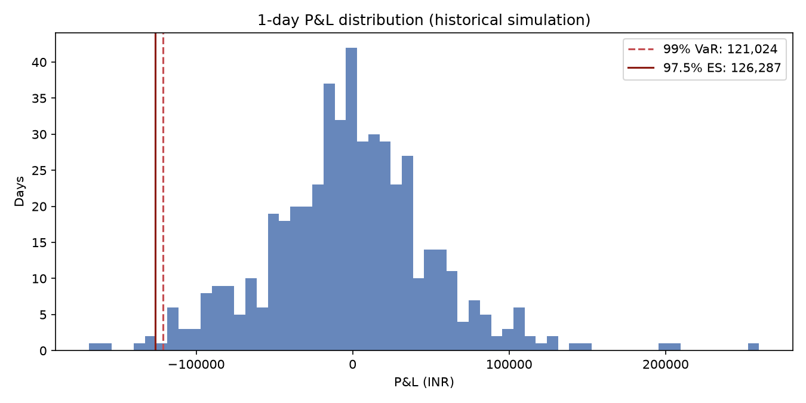
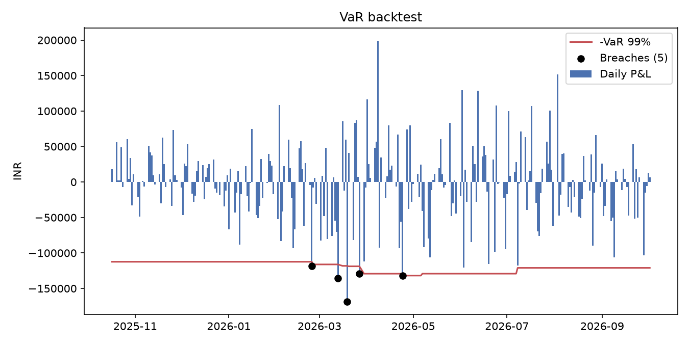

# Multi-Asset Market Risk Engine

Daily market risk report for a portfolio of Indian equities, a USD/INR position and NIFTY options.

## What it does

- **VaR and Expected Shortfall** by three methods: historical simulation, parametric (delta-normal) and Monte Carlo with full revaluation. 99% VaR and 97.5% ES, 1-day and scaled to 10-day.
- **Sensitivities**: Black-Scholes delta, gamma, vega and theta for the option book.
- **Component VaR**: which risk factors drive the total.
- **Limit monitoring**: VaR per desk against its limit, flagged OK / WARNING / BREACH.
- **Backtesting**: 250-day breach count, Kupiec proportion-of-failures test, Basel traffic light.
- **Stress testing**: hypothetical shocks plus a replay of the Feb–Mar 2020 crash.
- **P&L attribution**: option P&L explained by Greeks against full-revaluation P&L.
- **Excel report** (`output/risk_report.xlsx`) with a VBA macro for formatting and breach alerts.

## Run it

```
pip install -r requirements.txt
python main.py            # real data from Yahoo Finance (cached in data/prices.csv)
python main.py --refresh  # re-download the latest prices
python main.py --demo     # synthetic data, works offline
```

To add the macro: open `risk_report.xlsx`, press Alt+F11, File > Import File, choose `FormatRiskReport.bas`, save as `.xlsm`, then run `FormatReport`.

## Results

Real NSE data from January 2019 to 2 October 2026 (NIFTY 22,422, India VIX 14.5%). Portfolio: ₹80 lakh across eight NIFTY stocks, ₹17 lakh long USD/INR, and a NIFTY collar (long 98% put, short 103% call).

| Method | VaR 99% 1d | ES 97.5% 1d | VaR 99% 10d |
|---|---|---|---|
| Historical simulation | ₹121,024 | ₹126,287 | ₹382,711 |
| Parametric (delta-normal) | ₹122,895 | ₹123,500 | ₹388,627 |
| Monte Carlo (full revaluation) | ₹122,111 | ₹122,078 | ₹386,149 |

- **Backtest:** 5 breaches in 250 days against 2.5 expected. Kupiec p-value 0.16, so the model is not rejected at 5%, but it sits in the Basel yellow zone. The breaches cluster in February–April 2026, a sign of volatility clustering that a 500-day window is slow to pick up.
- **Stress:** the Feb–Mar 2020 replay loses ₹16.9 lakh, about 14 times the 1-day VaR. The collar recovers ₹11.7 lakh of the ₹29.6 lakh equity loss.
- **P&L attribution:** the Greeks explain 98% of the option book's daily P&L over the last 10 trading days. The unexplained part is largest on big-move days.
- **Limits:** the equity desk is at 83% of its limit (warning). Its standalone VaR of ₹166k is above the total VaR of ₹121k because the option hedge and diversification offset it.





## Files

| File | Purpose |
|---|---|
| `config.py` | Positions, confidence levels, limits, stress scenarios |
| `data.py` | Price download, cache and synthetic demo data |
| `risk_engine.py` | All the risk maths |
| `main.py` | Runs everything, writes the Excel report and charts |
| `FormatRiskReport.bas` | VBA macro |

## Assumptions and limitations

- Historical simulation assumes the last 500 days represent tomorrow.
- Parametric VaR assumes normal returns and sees options only through delta and vega, so it misses gamma.
- Monte Carlo uses normal returns, so it understates fat tails.
- India VIX is used as the implied volatility for every option (no skew or term structure).
- The backtest holds today's positions constant through history.
- 10-day figures use square-root-of-time scaling, which assumes independent daily returns.
